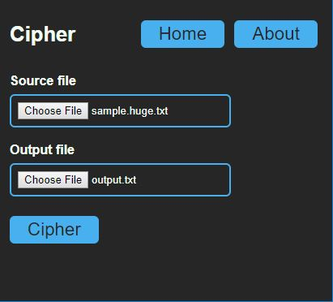
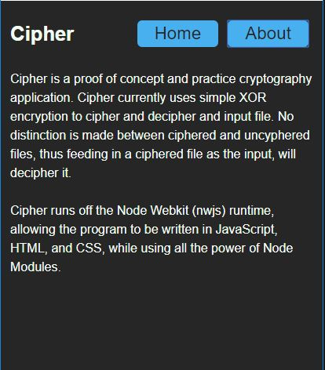
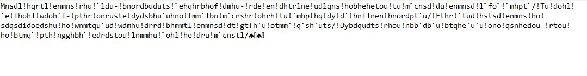

# Cipher
Cipher is a proof of concept and practice cryptography application *(windows)*, running off the [Node Webkit](https://github.com/nwjs/nw.js/) runtime and utilizing streams for io transformation.  

Cipher currently uses simple XOR encryption to cipher and decipher and input file. No distinction is made between ciphered and uncyphered files, thus feeding in a ciphered file as the input, will decipher it.  

# Usage
Download the distribution in the [dist folder](dist/Ciper-0.1.0-win-x86) and run the exe. Some sample files are provided in the sample folder within the distribution.

# Example
### Before
Lorem ipsum dolor sit amet, consectetur adipiscing elit, sed do eiusmod tempor incididunt ut labore et dolore magna aliqua. Ut enim ad minim veniam, quis nostrud exercitation ullamco laboris nisi ut aliquip ex ea commodo consequat. Duis aute irure dolor in reprehenderit in voluptate velit esse cillum dolore eu fugiat nulla pariatur. Excepteur sint occaecat cupidatat non proident, sunt in culpa qui officia deserunt mollit anim id est laborum.

### After ()

### Prod vs Dev install NOTE
The *install-production* and *install-development* npm scripts are for installing the newjs binary to run local development. They do NOT specify what version of nwjs to use for building for distribution
